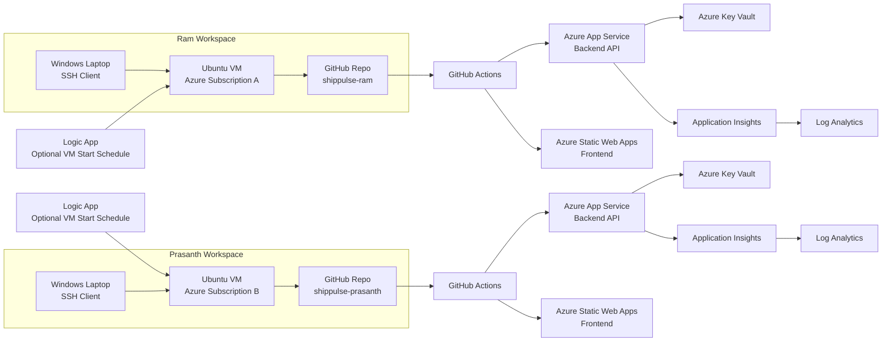

# ShipPulse Starter Repo

Ram and Prasanth have just joined ShipPulse. Farees is the course instructor. This repository is the startup handoff: clone or fork it, create your own repo in the shared GitHub org, build from your own Ubuntu VM, and prove you can ship frontend and backend changes through CI/CD.

## Who Owns What

- Frontend engineer: Ram
- Backend engineer: Prasanth
- Instructor: Farees
- Shared GitHub org: `AzureDevOpsC07AA`
- Required student repos:
  - `AzureDevOpsC07AA/shippulse-ram`
  - `AzureDevOpsC07AA/shippulse-prasanth`

Each engineer works in a separate Azure subscription and creates a separate Ubuntu VM. The VM is the primary development machine. The personal Windows laptop is only used to connect to the VM over SSH.

## Startup Workflow

1. Create your own private repo in `AzureDevOpsC07AA`.
2. Create your own Ubuntu VM in Azure.
3. SSH into the VM and install the required tools.
4. Clone your ShipPulse repo into the VM.
5. Run backend and frontend locally inside Ubuntu.
6. Update the Bicep parameter files with your own naming suffix.
7. Configure GitHub Actions secrets and environments.
8. Push to `develop` to validate CI and deploy to dev.
9. Promote to `main` to deploy to prod.
10. Verify App Service, Static Web Apps, Key Vault, Application Insights, and Log Analytics.

## Architecture

ShipPulse uses a VM-first developer workflow and GitHub Actions based deployment flow. Ram and Prasanth each use their own Ubuntu VM, push to their own GitHub repo, and deploy to Azure resources in their own subscription.



## Tech Stack

- Backend: .NET 10 Minimal API at `src/ShipPulse.Api`
- Frontend: Blazor WebAssembly at `src/ShipPulse.Web`
- Tests: `src/ShipPulse.Tests`
- Infrastructure as Code: Bicep in `infra/`
- CI/CD:
  - [deploy-backend.yml](/c:/Users/Mohamed Farees/Downloads/ShipPulse_StarterRepo_v3/shippulse-starter/.github/workflows/deploy-backend.yml)
  - [deploy-frontend.yml](/c:/Users/Mohamed Farees/Downloads/ShipPulse_StarterRepo_v3/shippulse-starter/.github/workflows/deploy-frontend.yml)

## Branch Model

- `develop` triggers dev deployment
- `main` triggers prod deployment

This is already how the GitHub workflow files behave. Do not invent a different branch model for this assignment.

## Required Azure Services

- Ubuntu VM: your Linux development machine
- Azure App Service: backend hosting
- Azure Static Web Apps: frontend hosting
- Azure Key Vault: runtime secret storage
- Application Insights: application telemetry
- Log Analytics: central log workspace
- Logic App: optional VM start automation for the learning environment

## Region

- Default region for VM, App Service, Key Vault, Application Insights, and Log Analytics: `Central India`
- Fallback region for those services if capacity is blocked: `South India`
- Static Web Apps location used by the validated pipeline: `East Asia`

If you use the fallback region, document it in your notes and keep the same region consistently for the related resources. Do not force Static Web Apps into `Central India`. The validated deployment uses `East Asia` because Static Web Apps availability differs from the rest of the stack.

## Repo Creation Rules

### Goal

Create your own private working repo in the shared GitHub org.

### Where to do this

GitHub web UI.

### Exact steps

1. Sign in to GitHub.
2. Open the `AzureDevOpsC07AA` organization.
3. Create a new private repository.
4. Use one of these exact names:
   - Ram: `shippulse-ram`
   - Prasanth: `shippulse-prasanth`
5. Start from this starter repository by either forking it into the org or pushing this starter code into the new repo.
6. Create a `develop` branch.
7. Keep `main` as the production branch.

### Expected result

You now have your own repo in the org and can push changes without affecting the other engineer.

### If blocked, check this

- Confirm you have permission to create private repos in `AzureDevOpsC07AA`.
- Confirm you did not create the repo under a personal account by mistake.

## Local Development Model

Do all code work from Ubuntu, not from the Windows laptop. The Windows laptop is just the SSH entry point.

Backend local run:

```bash
dotnet restore
dotnet run --project src/ShipPulse.Api
```

Frontend local run:

```bash
dotnet run --project src/ShipPulse.Web
```

Default local URLs:

- Backend: `http://localhost:5080`
- Frontend: `http://localhost:5170`
- Backend health endpoint: `http://localhost:5080/health`

Useful backend test commands:

```bash
curl -X GET "http://localhost:5080/health"
curl -X POST "http://localhost:5080/api/feedback" -H "Content-Type: application/json" -d "{\"message\":\"This is a test message from curl\",\"createdBy\":\"developer\"}"
curl -X GET "http://localhost:5080/api/feedback"
```

## CI/CD Overview

### Backend workflow

[deploy-backend.yml](/c:/Users/Mohamed Farees/Downloads/ShipPulse_StarterRepo_v3/shippulse-starter/.github/workflows/deploy-backend.yml) does this:

1. Restores, builds, tests, and publishes the API.
2. Signs in to Azure by reading the `AZURE_CREDENTIALS` GitHub secret.
3. On `develop`, deploys infra with `infra/env/dev.bicepparam` plus any values supplied in `ADDITIONAL_BICEP_PARAMS_DEV`, then deploys the backend to the dev App Service.
4. On `main`, deploys infra with `infra/env/prod.bicepparam` plus any values supplied in `ADDITIONAL_BICEP_PARAMS_PROD`, then deploys the backend to the prod App Service.

### Frontend workflow

[deploy-frontend.yml](/c:/Users/Mohamed Farees/Downloads/ShipPulse_StarterRepo_v3/shippulse-starter/.github/workflows/deploy-frontend.yml) does this:

1. Builds the Blazor app with `dotnet publish`.
2. Replaces `__API_BASE_URL__` in `src/ShipPulse.Web/wwwroot/appsettings.template.json`.
3. Signs in to Azure by reading the `AZURE_CREDENTIALS` GitHub secret.
4. Looks up the Static Web Apps deployment token from Azure by using `AZURE_STATIC_WEBAPP_NAME_DEV` or `AZURE_STATIC_WEBAPP_NAME_PROD`.
5. On `develop`, deploys the frontend to the dev Static Web App.
6. On `main`, deploys the frontend to the prod Static Web App.

## Important Files You Will Edit

- [README.md](/c:/Users/Mohamed Farees/Downloads/ShipPulse_StarterRepo_v3/shippulse-starter/README.md)
- [UBUNTU_SETUP.md](/c:/Users/Mohamed Farees/Downloads/ShipPulse_StarterRepo_v3/shippulse-starter/UBUNTU_SETUP.md)
- [docs/Student-Assignment.md](/c:/Users/Mohamed Farees/Downloads/ShipPulse_StarterRepo_v3/shippulse-starter/docs/Student-Assignment.md)
- [docs/Solution-Guide.md](/c:/Users/Mohamed Farees/Downloads/ShipPulse_StarterRepo_v3/shippulse-starter/docs/Solution-Guide.md)
- [infra/env/dev.bicepparam](/c:/Users/Mohamed Farees/Downloads/ShipPulse_StarterRepo_v3/shippulse-starter/infra/env/dev.bicepparam)
- [infra/env/prod.bicepparam](/c:/Users/Mohamed Farees/Downloads/ShipPulse_StarterRepo_v3/shippulse-starter/infra/env/prod.bicepparam)
- [deploy-backend.yml](/c:/Users/Mohamed Farees/Downloads/ShipPulse_StarterRepo_v3/shippulse-starter/.github/workflows/deploy-backend.yml)
- [deploy-frontend.yml](/c:/Users/Mohamed Farees/Downloads/ShipPulse_StarterRepo_v3/shippulse-starter/.github/workflows/deploy-frontend.yml)

## Validated Secrets Model

The proven GitHub workflow path uses these repo secrets:

- `AZURE_CREDENTIALS`
- `AZURE_RG_DEV`
- `AZURE_RG_PROD`
- `AZURE_WEBAPP_NAME_DEV`
- `AZURE_WEBAPP_NAME_PROD`
- `AZURE_STATIC_WEBAPP_NAME_DEV`
- `AZURE_STATIC_WEBAPP_NAME_PROD`
- `API_BASE_URL_DEV`
- `API_BASE_URL_PROD`

Optional override secrets used by the validated pipeline:

- `ADDITIONAL_BICEP_PARAMS_DEV`
- `ADDITIONAL_BICEP_PARAMS_PROD`

`AZURE_CREDENTIALS` is a JSON service principal secret. It is the Azure login used by both workflows.

## Start Here

- Ubuntu VM setup: [UBUNTU_SETUP.md](/c:/Users/Mohamed Farees/Downloads/ShipPulse_StarterRepo_v3/shippulse-starter/UBUNTU_SETUP.md)
- Student execution guide: [docs/Student-Assignment.md](/c:/Users/Mohamed Farees/Downloads/ShipPulse_StarterRepo_v3/shippulse-starter/docs/Student-Assignment.md)
- Instructor solution guide: [docs/Solution-Guide.md](/c:/Users/Mohamed Farees/Downloads/ShipPulse_StarterRepo_v3/shippulse-starter/docs/Solution-Guide.md)
